# Secrets and Injection Patterns

Three distinct patterns handle secrets across the AI tool ecosystem. Each enforces
a different trust boundary and serves a different use case.

## Documents in This Directory

_This document is part of [`docs/architecture/`](README.md)._

## The Three Patterns

```mermaid
graph TD
    subgraph P1["Pattern 1: Doppler Subprocess Wrapper"]
        DM["doppler-mcp wrapper\n(shell script)"]
        DP["doppler run -p ai-ci-automation -c prd"]
        BIN["MCP server binary"]
        DM --> DP --> BIN
    end

    subgraph P2["Pattern 2: macOS Keychain via Shell Init"]
        KCH["macOS Keychain\n(security find-generic-password)"]
        SH["Shell init\n(~/.zshrc / ~/.config/fish/*)"]
        ENV["Process environment\n(HF_TOKEN, GITHUB_PAT)"]
        KCH --> SH --> ENV
    end

    subgraph P3["Pattern 3: Kubernetes Doppler Operator"]
        DOP["Doppler (cloud)"]
        K8S["K8s Doppler Operator\n(in-cluster)"]
        SEC["K8s Secrets\n(provider API keys)"]
        POD["Bifrost / Cribl pods"]
        DOP --> K8S --> SEC --> POD
    end
```



## Pattern 1: Doppler Subprocess Wrapper

**Used by**: PAL MCP, Google Workspace MCP, Splunk MCP

The `doppler-mcp` shell script wraps the real binary:

```bash
exec doppler run -p ai-ci-automation -c prd \
  --fallback <encrypted-cache-path> \
  -- "$@"
```

Doppler injects secrets as environment variables into the child process. The secrets
never appear in `~/.claude.json`, Nix store paths, or any file that could be
accidentally committed.

**Doppler project**: `ai-ci-automation`, config `prd`

**Secrets injected for PAL**: `GEMINI_API_KEY`, `OPENAI_API_KEY`, `OPENROUTER_API_KEY`

**Fallback cache**: An encrypted local file used when Doppler is unreachable (offline work).
The fallback is stored in the Nix store and never written to a user-writable location.

**Why no preflight check**: PAL's startup is fast and runs in parallel with ~17 other MCP
servers at Claude Code launch. A Doppler connectivity check before each launch would add
latency. The encrypted fallback handles offline scenarios.

## Pattern 2: macOS Keychain via Shell Init

**Used by**: HuggingFace MCP (`HF_TOKEN`), GitHub MCP (`GITHUB_PERSONAL_ACCESS_TOKEN`)

Secrets are stored in the macOS Keychain and exported as environment variables during
shell initialization via `_get_keychain_secret` (defined in `nix-home`). MCP servers
inherit these from the process environment — no wrapper needed.

**Limitation**: This only works for MCP servers launched from a shell that ran the init
scripts. Claude Code (a desktop app) may have a different PATH and environment than a
terminal session. If a Keychain-dependent server fails with auth errors, verify the
variable is exported by checking `env | grep HF_TOKEN` in a Claude session.

## Pattern 3: Kubernetes Doppler Operator (In-Cluster)

**Used by**: Bifrost AI gateway, Cribl MCP (both in `orbstack-kubernetes` repo)

The [Doppler Kubernetes Operator](https://docs.doppler.com/docs/kubernetes-operator)
syncs secrets from Doppler into native Kubernetes Secrets objects inside the OrbStack
cluster. The provider API keys (OpenAI, Anthropic, Gemini, OpenRouter) are injected
directly into the Bifrost and Cribl pods at runtime.

**These secrets never reach the MCP client process.** Claude Code connects to Bifrost
at `http://localhost:30080/mcp` — Bifrost authenticates to upstream providers using its
own in-cluster credentials. The client only needs network access to :30080.

This is the cleanest pattern: zero credential exposure outside the cluster boundary.

## Secrets by Product

| Product | Secret | Pattern | Where Configured |
|---------|--------|---------|-----------------|
| PAL MCP | `GEMINI_API_KEY`, `OPENAI_API_KEY`, `OPENROUTER_API_KEY` | Doppler subprocess | `ai-ci-automation/prd` Doppler project |
| Google Workspace MCP | `GOOGLE_CLIENT_ID`, `GOOGLE_CLIENT_SECRET` | Doppler subprocess | `ai-ci-automation/prd` Doppler project |
| Splunk MCP | `SPLUNK_MCP_ENDPOINT`, `SPLUNK_MCP_TOKEN` | Doppler subprocess | `ai-ci-automation/prd` Doppler project |
| HuggingFace MCP | `HF_TOKEN` | Keychain → shell env | macOS Keychain (`huggingface-token`) |
| GitHub MCP | `GITHUB_PERSONAL_ACCESS_TOKEN` | Keychain → shell env | macOS Keychain |
| Bifrost | Provider API keys | K8s Doppler Operator | OrbStack cluster |
| Cribl | Provider credentials | K8s Doppler Operator | OrbStack cluster |
| WakaTime | `WAKATIME_API_KEY` | Activation-time Doppler fetch | Written to `~/.wakatime.cfg` at `darwin-rebuild switch` |

## What NOT to Do

- **Never put secrets in `env:` blocks of MCP server definitions** in `modules/mcp/default.nix`.
  These flow into `~/.claude.json`, which is not secret-protected. They also appear in
  the Nix store derivation (world-readable at `/nix/store/`).
- **Never hardcode API keys in Nix expressions.** Even in a private repo, they end up
  in the Nix store. Use Doppler or Keychain.
- **Never commit `.env` files** containing real keys. The `~/.config/fabric/.env` file
  (for Fabric's cloud providers) is user-created and gitignored; it is not managed by Nix.

For the full MCP-specific secrets reference, see `modules/mcp/README.md` → Secrets Management.
