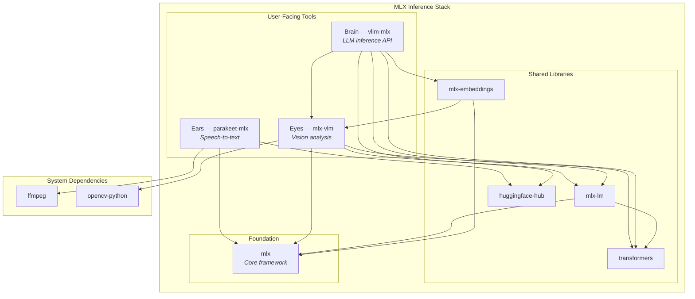

# nix-ai-claude - AI Agent Instructions

Standalone Claude-specific AI CLI ecosystem extracted from nix-ai.

## Critical Constraints

1. **Flakes-only**: Never use `nix-env` or imperative Nix commands
2. **Module args injection**: All flake inputs reach modules via `_module.args`, not function parameters
3. **Worktrees required**: Run `/refresh-repo` then create a worktree before any work
4. **No direct main commits**: Always use feature branches

## Validation

**Static** (every change):

```bash
nix flake check    # Formatting, statix, deadnix, regression tests
nix fmt            # Fix formatting
```

**Runtime** (changes to plugins, hooks, settings, activations, MCP servers):

```bash
sudo darwin-rebuild switch --flake "$HOME/git/nix-darwin/main" \
  --override-input nix-ai-claude "$HOME/git/nix-ai-claude/<worktree>"
```

Then verify in a live Claude Code session — static checks validate Nix
evaluation, not runtime behavior. Start a fresh session and confirm the
feature loads without errors before claiming done.

## Architecture

This repo exports home-manager modules consumed by nix-darwin or by nix-ai:

- `homeManagerModules.default` — Claude module stack for standalone use
- `homeManagerModules.claude` — Claude Code only
- `lib.ci.claudeSettingsJson` — Pure JSON for CI validation

### Self-contained design

Modules inject their own dependencies via `_module.args`. Consumers only need:

```nix
inputs.nix-ai-claude.inputs.nixpkgs.follows = "nixpkgs";
inputs.nix-ai-claude.inputs.home-manager.follows = "home-manager";
```

## Separation Guidelines

### What belongs here (nix-ai-claude)

- Claude Code settings, plugins, statusline, auto-claude
- Supporting MCP/pal/fabric integration needed by Claude
- Shared permissions/formatter helpers needed by Claude config

### Package placement

The `nix-package-placement` rule lives in
[ai-assistant-instructions/agentsmd/rules/nix-package-placement.md](https://github.com/JacobPEvans/ai-assistant-instructions/blob/main/agentsmd/rules/nix-package-placement.md)
and auto-loads via path-scoping when `.nix` / `flake.*` files are in context.
It contains the full decision matrix for the nix repos, including homebrew
constraints and on-demand patterns.

## Key Files

- `modules/default.nix` — Standalone module entry point
- `modules/embedded.nix` — Embedded entrypoint consumed by nix-ai
- `modules/claude/` — Claude Code settings, plugins, statusline, auto-claude
- `modules/mcp/` — PAL / model sync support used by Claude
- `modules/common/` — Shared permission engine and formatters
- `lib/claude-settings.nix` — Pure settings generator (CI-only)
- `lib/claude-registry.nix` — Marketplace format functions
- `lib/checks/fabric.nix` — Fabric regression checks

## MLX Ecosystem Stack

Three user-facing tools built on the MLX core framework for Apple Silicon inference:

| Role | Package | Purpose | Install Method |
| ---- | ------- | ------- | -------------- |
| Ears (Audio) | `parakeet-mlx` | Real-time speech-to-text | `uvx` wrapper (Nix derivation) |
| Eyes (Vision) | `mlx-vlm` | Screen/camera image analysis | `uvx` wrapper (Nix derivation) |
| Brain (LLM) | `vllm-mlx` | LLM inference API server | `uvx` wrapper (LaunchAgent) |

### Dependency graph



### Version management

- **Version constants**: `modules/mlx/default.nix` — single source of truth with Renovate annotations
- **uvx wrappers**: `modules/mlx/packages.nix` — declarative Nix derivations for the MLX tools
- **Auto-update**: Renovate annotation-based manager bumps version constants, weekly schedule

## Port Allocation

Services managed by nix-ai and their assigned ports. Check this table before assigning
new ports to avoid collisions (e.g., the 11434/11435/11436 fragmentation during the MLX arc).

| Port | Service | Protocol | Module |
| ---- | ------- | -------- | ------ |
| 11434 | llama-swap proxy (routes to vllm-mlx) | HTTP (OpenAI-compatible) | `modules/mlx/` |
| 11436 | vllm-mlx backend (internal, managed by llama-swap) | HTTP | `modules/mlx/` |
| 8080 | Open WebUI | HTTP | `modules/open-webui.nix` |
| 8180 | Fabric REST API (opt-in LaunchAgent) | HTTP + Swagger UI | `modules/fabric/` |

**Reserved/conflicting ports to avoid:**

- 11435: reserved — external macOS app conflict (see PR #230)

## Related Repos

| Repo | Purpose |
| ---- | ------- |
| **nix-ai** (this repo) | AI coding tools |
| [nix-devenv](https://github.com/JacobPEvans/nix-devenv) | Reusable dev shells (Terraform, Ansible, K8s, AI/ML) |
| [nix-home](https://github.com/JacobPEvans/nix-home) | Dev environment (git, zsh, VS Code, tmux) |
| [nix-darwin](https://github.com/JacobPEvans/nix-darwin) | macOS system config (consumes the others) |
